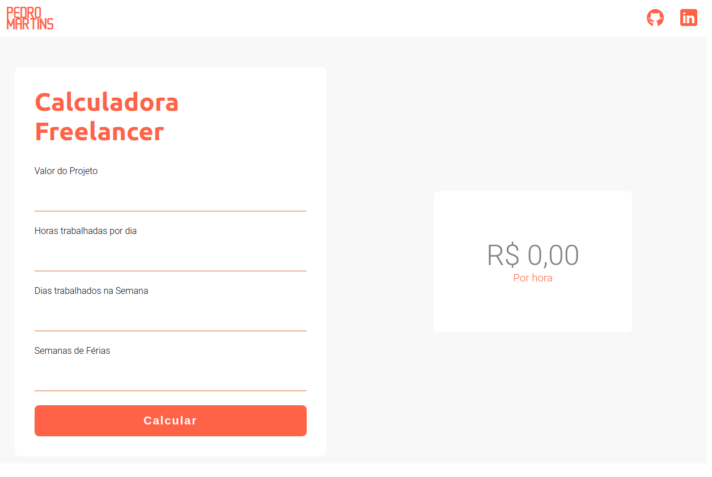

# Freelance-calculator

## :orange_book: Projeto

A calculadora freelancer tem o objetivo de auxiliar o Freelancers a calcularem o valor de sua hora de trabalho de forma fácil e acesível.

## :computer: Tecnologias

Foram usadas as seguintes tcnologias neste projeto:

- HTML
- CSS
- Javascript

## :smiley: Como usar?

Basta Acessar esse link:

[Freelance Calculator](https://pedromartinscap.github.io/freelance-calculator/)

 Feito com :yellow_heart: por Pedro Henrique - [LinkeIn](https://www.linkedin.com/in/pedrohenriqueoliveiramartins/)